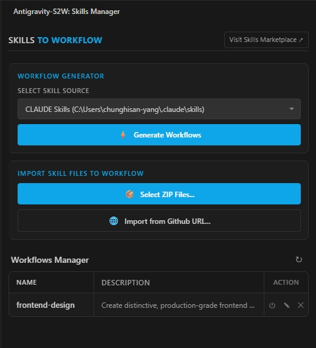

# Antigravity-S2W（技能轉工作流程）

> **將 AI 技能定義轉換為可執行的 IDE 工作流程**

[English](README.md)

---

> [!NOTE]
> **Gemini CLI** 預覽版現已原生支援 Skills 功能！前往 [google-gemini/gemini-cli](https://github.com/google-gemini/gemini-cli) 了解更多。
>
> 本專案為 [Antigravity IDE](https://antigravity.dev) 使用者提供**臨時替代方案**。透過產生工作流程檔案，讓 Antigravity 能夠定位並根據 `SKILL.md` 定義執行技能。產生後，使用者可在對話介面中使用 **`/`（斜線命令）** 呼叫想使用的技能。

---

## 概述

**Antigravity-S2W** 是一個 VS Code 擴充套件，可以批次分析已安裝於 Claude/Codex/Gemini(即將支援) 的 Skills 的檔案，將它們轉為簡單的 Global Workslow，讓妳在 Antigravity 對話中，能夠透過 `/` 指令去選取並呼叫想使用的技能，也支持手動選取 Skill ZIP 檔，或直接從 github 網址安裝 Skill。



## 功能特色

### 🔄 工作流程生成器

- 掃描多個 AI 供應商的技能目錄
- 解析 `SKILL.md` 的 metadata（名稱、描述）
- 產生標準化的工作流程檔案

### 📦 技能匯入器

- **ZIP 匯入**：選擇並解壓縮技能套件
- **GitHub 下載**：直接從 GitHub 儲存庫 URL 下載技能

### 📋 工作流程管理器

- 檢視所有已生成的工作流程
- 啟用/停用工作流程（切換 `.disable` 後綴）
- 直接編輯工作流程檔案
- 刪除工作流程及其來源檔案

## 運作原理

```text
┌─────────────────────────────────────────────────────────────────┐
│                        技能來源                                  │
├─────────────────────────────────────────────────────────────────┤
│  ~/.gemini/skills/      (Gemini 技能)                           │
│  ~/.claude/skills/      (Claude 技能)                           │
│  ~/.codex/skills/       (Codex 技能)                            │
│  [自訂資料夾]            (使用者選擇)                            │
└───────────────────────────┬─────────────────────────────────────┘
                            │
                            ▼
┌─────────────────────────────────────────────────────────────────┐
│                    ANTIGRAVITY-S2W 處理流程                      │
├─────────────────────────────────────────────────────────────────┤
│  1. 掃描選定的來源目錄                                           │
│  2. 在每個子目錄中尋找 SKILL.md 或 README.md                     │
│  3. 解析 YAML frontmatter（名稱、描述）                          │
│  4. 產生包含技能參照的 workflow .md 檔案                         │
└───────────────────────────┬─────────────────────────────────────┘
                            │
                            ▼
┌─────────────────────────────────────────────────────────────────┐
│                        輸出位置                                  │
├─────────────────────────────────────────────────────────────────┤
│  ~/.gemini/antigravity/global_workflows/                        │
│  ├── skill-name-1.md                                            │
│  ├── skill-name-2.md                                            │
│  └── skill-name-3.md.disable  (已停用)                          │
└─────────────────────────────────────────────────────────────────┘
```

## 安裝方式

### 從 VSIX 安裝（手動）

1. 從 [Releases](../../releases) 下載 `.vsix` 檔案
2. 在 VS Code 中：`Ctrl+Shift+P` → `Extensions: Install from VSIX...`
3. 選擇下載的檔案

### 從原始碼安裝

```bash
git clone https://github.com/YOUR_USERNAME/antigravity-s2w.git
cd antigravity-s2w
npm install
npm run compile
# 在 VS Code 按 F5 啟動擴充套件開發主機
```

## 使用說明

### 生成工作流程

1. 點擊活動列中的 **Antigravity-S2W** 圖示
2. 從下拉選單選擇**技能來源**：
   - Gemini Skills（`~/.gemini/skills/`）
   - Claude Skills（`~/.claude/skills/`）
   - Codex Skills（`~/.codex/skills/`）
   - 或選擇自訂資料夾
3. 點擊 **Generate Workflows**
4. 工作流程將建立在 `~/.gemini/antigravity/global_workflows/`

### 從 ZIP 匯入技能

> 提示：您可以從 [Skills Marketplace](https://skillsmp.com) 下載技能包。

1. 點擊 **Select ZIP Files...**
2. 選擇一個或多個包含技能資料夾的 `.zip` 檔案
3. 擴充套件將會：
   - 解壓縮內容至 `~/.gemini/skills/[技能名稱]/`
   - 自動產生工作流程

### 從 GitHub 下載技能

1. 點擊 **Download from URL...**
2. 輸入 GitHub 資料夾 URL，例如：

   ```text
   https://github.com/user/repo/tree/main/skills/my-skill
   ```

3. 擴充套件將會：
   - 下載資料夾中的所有檔案
   - 儲存至 `~/.gemini/skills/[技能名稱]/`
   - 產生工作流程

### 管理工作流程

| 操作 | 說明 |
| --- | --- |
| **⏻**（切換） | **啟用/停用**：將 `~/.gemini/antigravity/global_workflows/` 中的副檔名在 `.md`（啟用）與 `.md.disable`（停用）之間切換。 |
| **✎**（編輯） | **開啟檔案**：在編輯器中開啟已生成的工作流程 `.md` 檔案以進行修改。 |
| **✕**（刪除） | **移除**：從 `global_workflows/` 刪除工作流程檔案，**同時**移除 `~/.gemini/skills/` 中的對應來源資料夾。 |

## 技能檔案格式

技能定義在 `SKILL.md` 中，使用 YAML frontmatter：

```markdown
---
description: 此技能功能的簡短描述
---

# 技能名稱

詳細的文件說明與使用指南...
```

## 產生的工作流程格式

```markdown
---
description: [從 SKILL.md 擷取]
---

# 啟用技能：[技能名稱]

請閱讀並內化以下路徑的技能文件：
**`~/.gemini/skills/[技能名稱]/SKILL.md`**

## 任務
[擷取的描述]

## 指示
1. **載入脈絡**：閱讀上方提供的檔案路徑。
2. **啟用人格**：採用該文件中定義的角色。
3. **執行**：等待進一步的使用者指示。
```

## 系統需求

- VS Code 1.90.0 或更高版本
- Node.js（開發用）

## 授權條款

MIT 授權 - 詳見 [LICENSE](LICENSE)

## 致謝

- [jszip](https://github.com/Stuk/jszip) - ZIP 檔案處理（MIT 授權）
